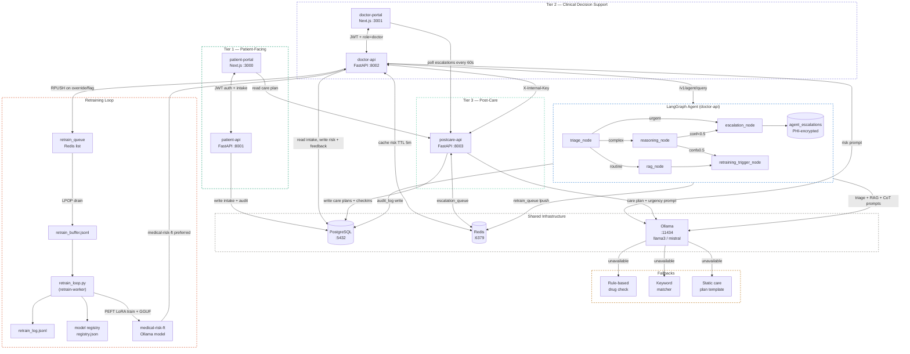

# System Architecture

## Overview

CaduceusAI is a three-tier, local-first medical AI system. Every tier owns a dedicated FastAPI backend and (where needed) a Next.js frontend. All tiers share a single PostgreSQL database, a Redis instance, and an Ollama LLM server. The platform ships as a Docker Compose stack for local development and as a fully managed AWS deployment via Terraform.

```
┌─────────────────────────────────────────────────────────────────────┐
│  TIER 1 — Patient-Facing                                            │
│  patient-portal (Next.js :3000)  ←→  patient-api (FastAPI :8001)   │
├─────────────────────────────────────────────────────────────────────┤
│  TIER 2 — Clinical Decision Support                                 │
│  doctor-portal (Next.js :3001)   ←→  doctor-api (FastAPI :8002)    │
├─────────────────────────────────────────────────────────────────────┤
│  TIER 3 — Post-Care                                                 │
│  postcare-api (FastAPI :8003)                                       │
├─────────────────────────────────────────────────────────────────────┤
│  SHARED INFRASTRUCTURE                                              │
│  PostgreSQL :5432  |  Redis :6379  |  Ollama :11434                 │
└─────────────────────────────────────────────────────────────────────┘
```



---

## Directory Layout

```
medical-ai-platform/
├── docker-compose.yml              # Full stack orchestration (local)
├── .env.example                    # Configuration template
├── alembic.ini                     # Alembic configuration
├── alembic/
│   ├── env.py                      # Reads DATABASE_URL from environment
│   └── versions/
│       └── 001_initial_schema.py   # Creates all 8 tables + extensions
├── db/
│   └── init.sql                    # PostgreSQL extension bootstrap
├── services/
│   ├── patient_api/                # Tier 1 backend  (port 8001)
│   ├── doctor_api/                 # Tier 2 backend  (port 8002)
│   │   └── agent/                  # LangGraph orchestration layer
│   └── postcare_api/               # Tier 3 backend  (port 8003)
├── frontend/
│   ├── patient_portal/             # Tier 1 UI  (port 3000)
│   └── doctor_portal/              # Tier 2 UI  (port 3001)
├── terraform/                      # AWS infrastructure (Terraform)
│   ├── main.tf                     # Provider + backend config
│   ├── variables.tf
│   ├── outputs.tf
│   ├── vpc.tf                      # VPC, subnets, IGW, NAT gateways
│   ├── security_groups.tf          # Per-tier security groups
│   ├── ecr.tf                      # ECR repositories + lifecycle policies
│   ├── iam.tf                      # ECS roles, CloudWatch log groups
│   ├── secrets.tf                  # AWS Secrets Manager
│   ├── rds.tf                      # PostgreSQL 16 Multi-AZ
│   ├── elasticache.tf              # Redis 7 replication group
│   ├── alb.tf                      # ALB, listener rules, target groups
│   ├── ecs.tf                      # ECS cluster, task definitions, services
│   └── ollama.tf                   # EC2 g4dn.xlarge for GPU inference
├── services/
│   ├── retrain_worker/             # LoRA fine-tuning worker service
│   │   ├── Dockerfile
│   │   ├── requirements.txt        # torch (CPU), peft, transformers, trl, ...
│   │   └── worker.py               # Polling loop → calls retrain_loop.process_buffer()
├── scripts/
│   └── retrain_loop.py             # Full LoRA pipeline (also mountable for manual runs)
└── data/
```

---

## Service Responsibilities

| Service | Port | Owns |
|---|---|---|
| `patient-api` | 8001 | Patient auth, intake storage, encrypted PHI |
| `doctor-api` | 8002 | Doctor auth, LLM risk assessment, feedback, retrain queue, LangGraph agent |
| `postcare-api` | 8003 | Care plan generation, follow-up check-ins, escalation creation |
| `patient-portal` | 3000 | Patient registration, intake wizard, care plan dashboard |
| `doctor-portal` | 3001 | Patient list, AI risk panel, feedback form, escalation alerts |
| `postgres` | 5432 | Single shared database (all tables) |
| `redis` | 6379 | Risk assessment cache, retrain queue, escalation queue |
| `ollama` | 11434 | Local LLM inference (llama3 / mistral / medical-risk-ft) |
| `ollama-init` | — | One-shot: pulls llama3 + mistral into shared `ollama_data` volume |
| `migrate` | — | One-shot: runs `alembic upgrade head` before APIs start |
| `retrain-worker` | — | Continuous: polls buffer, runs PEFT LoRA training, registers fine-tuned model with Ollama |

---

## Request Flows

### Patient Login

```
patient-portal
  → POST /v1/auth/token  (patient-api:8001)
      ├── Verify credentials
      ├── Issue JWT (HS256, 30 min TTL)
      ├── Set httpOnly cookie: patient_access_token
      └── Return { patient_id, token_type: "cookie" }

Browser stores patient_id in localStorage (not the JWT).
Subsequent requests send the cookie automatically.
```

### Patient Intake

```
patient-portal
  → POST /v1/patients/intake  (patient-api:8001)
      ├── Read patient_access_token cookie (or Bearer fallback)
      ├── Decode + verify JWT
      ├── Validate Pydantic schema (symptoms 10–5000 chars)
      ├── Write PatientIntake row
      └── Write AuditLog row
```

### Risk Assessment

```
doctor-portal
  → GET /v1/doctor/patients/{id}/risk  (doctor-api:8002)
      ├── Read doctor_access_token cookie (or Bearer fallback)
      ├── Validate JWT + assert role=doctor
      ├── Read PatientIntake from PostgreSQL
      ├── Check Redis cache (key: risk:{patient_id}, TTL 5m)
      │   ├── HIT  → return cached assessment
      │   └── MISS → call llm.get_risk_assessment()
      │               ├── Try Ollama (llama3 → mistral, 120s timeout)
      │               └── FALLBACK: rule-based drug interaction check
      ├── Write RiskAssessment row
      ├── Set Redis cache
      └── Return assessment
```

### Feedback + Cache Invalidation

```
doctor-portal
  → POST /v1/doctor/patients/{id}/feedback  (doctor-api:8002)
      ├── Write Feedback row
      ├── DELETE Redis key risk:{patient_id}   ← cache invalidated
      └── If action == override|flag:
          └── RPUSH retrain_queue  (Redis)
```

### Follow-up Check-in & Escalation

```
patient-portal (or API client)
  → POST /v1/followup/checkin  (postcare-api:8003)
      ├── Read patient_access_token or doctor_access_token cookie
      ├── Validate symptom_report (10–5000 chars)
      ├── Read latest CarePlan (warning_signs)
      ├── Call llm.assess_checkin_urgency()
      │   ├── Ollama urgency classification (routine|monitor|escalate)
      │   └── FALLBACK: keyword matching
      ├── Write FollowupCheckin row
      ├── If urgency == escalate:
      │   ├── Write Escalation row
      │   └── Push to Redis escalation_queue
      └── Return checkin + urgency

doctor-portal
  → polls GET /v1/escalations/pending  every 60s  (postcare-api:8003)
  → POST /v1/escalations/{id}/acknowledge
```

### Agent Query (LangGraph)

```
doctor-portal (or API client)
  → POST /v1/agent/query  (doctor-api:8002)
      ├── Validate JWT + assert role=doctor
      ├── Invoke LangGraph graph (5-node StateGraph)
      │
      │   triage_node
      │     └── Ollama: classify query as routine / complex / urgent
      │         (fallback: "complex" if Ollama unreachable)
      │
      │   [routine path]
      │     rag_node
      │       ├── Retrieve top-3 docs from in-memory KB
      │       └── Ollama: synthesise answer from context
      │     retraining_trigger_node
      │       ├── Check feedback_score < RETRAIN_SCORE_THRESHOLD (0.4)?
      │       │   └── YES → LPUSH retrain_queue (Redis)
      │       └── Write AuditLog row → END
      │
      │   [complex path, confidence ≥ 0.5]
      │     reasoning_node
      │       └── Ollama: chain-of-thought reasoning
      │     retraining_trigger_node → AuditLog → END
      │
      │   [complex path, confidence < 0.5]  OR  [urgent path]
      │     escalation_node
      │       ├── encrypt(query) → AgentEscalation row (PostgreSQL)
      │       └── Write AuditLog row → END
      │
      └── Return AgentQueryResponse
          { query_type, response, confidence,
            requires_escalation, escalation_id, chain_of_thought }
```

### Feedback → Retraining

```
doctor-portal
  → POST /v1/doctor/patients/{id}/feedback  (doctor-api:8002)
      └── If action == override|flag:
          └── RPUSH retrain_queue  (Redis)

  (also triggered by LangGraph agent when feedback_score < 0.4)
  → retraining_trigger_node  (agent/nodes.py)
      └── LPUSH retrain_queue  (Redis)

(manual or scheduled)
  → POST /v1/doctor/retrain/trigger  (doctor-api:8002, requires X-Internal-Key)
      └── LPOP all items from retrain_queue
          └── Append to data/retrain_buffer.jsonl

retrain-worker  (polls every RETRAIN_POLL_INTERVAL_SECONDS, default 5 min)
  → scripts/retrain_loop.py
      ├── Check len(buffer) >= MIN_RETRAIN_BATCH (default 5)
      ├── Query risk_assessments + patient_intake for each assessment_id
      ├── Build Alpaca {instruction, input, output} examples
      ├── PEFT LoRA fine-tune TinyLlama-1.1B (CPU, 2 epochs)
      ├── Merge adapter → save HuggingFace model
      ├── Convert to GGUF via llama.cpp (convert_hf_to_gguf.py)
      ├── POST /api/create on Ollama  → medical-risk-ft:latest
      ├── Write run record to data/retrain_log.jsonl
      ├── Append to /app/models/registry.json
      └── Clear buffer (only on success)

doctor-api  (on next risk assessment request)
  → llm.get_risk_assessment()
      └── _model_priority_list():  medical-risk-ft → llama3 → mistral → rule_based
```

---

## Docker Compose Startup Order (Local)

```
postgres  ──(healthy)──┐
                       ├──→  migrate ──(completed)──┐
redis     ──(healthy)──┘                            ├──→  patient-api
                                                    ├──→  doctor-api
                                                    └──→  postcare-api

ollama ──(healthy)──→  ollama-init  (pulls llama3 + mistral; runs once)

postgres  ──(healthy)──┐
redis     ──(healthy)──├──→  retrain-worker  (continuous polling loop)
ollama    ──(healthy)──┘

patient-api  ──(started)──→  patient-portal
doctor-api   ──(started)──→  doctor-portal
```

---

## AWS Deployment Architecture

The `terraform/` directory provisions a production-grade AWS environment that mirrors the Docker Compose topology.

```
Internet
    │
    ▼
┌──────────────────────────────────────┐
│  Application Load Balancer (public)  │
│  HTTP :80 → redirect to HTTPS        │
│  HTTPS :443 (when ACM cert provided) │
│                                      │
│  Listener rules (path-based):        │
│    /api/patient/*  → patient-api TG  │
│    /api/doctor/*   → doctor-api TG   │
│    /api/postcare/* → postcare-api TG │
│    doctor.<domain> → doctor-portal TG│
│    default         → patient-portal TG│
└──────────────────┬───────────────────┘
                   │  (private subnets)
        ┌──────────┼──────────────────────────────┐
        │          │                              │
        ▼          ▼                              ▼
  ECS Fargate   ECS Fargate                ECS Fargate
  patient-api   doctor-api / postcare-api  patient-portal
  (port 8001)   (ports 8002, 8003)         doctor-portal
                                           (ports 3000, 3001)
        │
        ├──→  RDS PostgreSQL 16 (Multi-AZ, private subnet)
        ├──→  ElastiCache Redis 7 (primary + replica, private subnet)
        └──→  EC2 g4dn.xlarge — Ollama (private subnet, GPU inference)
```

### AWS Resource Map

| Docker Compose service | AWS equivalent |
|---|---|
| `postgres` | RDS PostgreSQL 16 (Multi-AZ, `db.t3.medium`, encrypted at rest) |
| `redis` | ElastiCache Redis 7 (replication group, `cache.t3.micro`, encrypted at rest) |
| `ollama` | EC2 `g4dn.xlarge` (NVIDIA T4 GPU, 100 GB EBS, user-data installs Ollama + pulls models) |
| All 5 app services | ECS Fargate tasks in private subnets (2 desired per service) |
| Docker image registry | ECR (one repo per service, scan-on-push, lifecycle: keep last 10) |
| `.env` secrets | AWS Secrets Manager (`medical-ai/<env>/app-secrets`) |
| Container logs | CloudWatch Logs (`/ecs/medical-ai/<service>`, 30-day retention) |

### Terraform Files

| File | Purpose |
|---|---|
| `main.tf` | AWS provider, Terraform version constraints, optional S3 backend |
| `variables.tf` | All input variables (region, secrets, instance types, image URIs, domain) |
| `outputs.tf` | ALB DNS, ECR URLs, cluster name, subnet IDs, RDS/Redis endpoints |
| `vpc.tf` | VPC (10.0.0.0/16), 2 public + 2 private subnets, IGW, NAT Gateways, route tables |
| `security_groups.tf` | ALB SG (0.0.0.0/0:80,443), ECS SG (from ALB + self), RDS SG (from ECS), Redis SG (from ECS), Ollama SG (from ECS) |
| `ecr.tf` | Five ECR repositories + lifecycle policies (keep last 10 images) |
| `iam.tf` | ECS execution role (pull images, Secrets Manager, CloudWatch), ECS task role (CloudWatch metrics), CloudWatch log groups |
| `secrets.tf` | Secrets Manager secret containing JWT, Fernet, internal API key, DB password |
| `rds.tf` | PostgreSQL 16 RDS instance, subnet group, parameter group |
| `elasticache.tf` | Redis 7 replication group, subnet group |
| `alb.tf` | ALB, S3 access-log bucket, target groups (one per service), HTTP + optional HTTPS listeners, path/host-based routing rules |
| `ecs.tf` | ECS cluster (Container Insights on), task definitions per service, ECS services with circuit breakers, one-shot migration task definition |
| `ollama.tf` | EC2 with AL2023 AMI, user-data that installs CUDA + Ollama + pulls models, IAM instance profile (SSM + CloudWatch) |

### Deployment Workflow

```bash
cd terraform

# Step 1 — fill in terraform.tfvars (copy from .example)
cp terraform.tfvars.example terraform.tfvars

# Step 2 — provision infrastructure (VPC, RDS, Redis, Ollama EC2, ALB, ECR)
terraform init
terraform apply

# Step 3 — push Docker images to ECR
aws ecr get-login-password --region us-east-1 | \
  docker login --username AWS --password-stdin \
  $(terraform output -json ecr_repository_urls | jq -r '.["patient-api"]' | cut -d/ -f1)

# Build and push each service (example for patient-api)
docker build -t patient-api ./services/patient_api
docker tag patient-api $(terraform output -json ecr_repository_urls | jq -r '.["patient-api"]'):latest
docker push $(terraform output -json ecr_repository_urls | jq -r '.["patient-api"]'):latest

# Step 4 — run DB migrations (one-time, or after schema changes)
aws ecs run-task \
  --cluster $(terraform output -raw ecs_cluster_name) \
  --task-definition $(terraform output -raw migrate_task_definition_arn) \
  --launch-type FARGATE \
  --network-configuration "awsvpcConfiguration={
    subnets=[$(terraform output -json private_subnet_ids | jq -r '.[0]')],
    securityGroups=[$(terraform output -raw ecs_tasks_security_group_id)],
    assignPublicIp=DISABLED}"

# Step 5 — update image URIs in terraform.tfvars and re-apply to force ECS redeployment
terraform apply
```

### Ollama EC2 Notes

- Instance type: `g4dn.xlarge` (4 vCPU, 16 GB RAM, NVIDIA T4 GPU)
- Model weights: stored on the root EBS volume (100 GB, `delete_on_termination = false`, `prevent_destroy = true`)
- Bootstrap: user-data installs CUDA drivers, Ollama as a systemd service, then pulls `llama3` and `mistral` (~9 GB total) in the background — expect ~10 minutes on first boot
- SSH access: optional; set `ollama_key_pair_name` in `terraform.tfvars`. Alternatively, use AWS Systems Manager Session Manager (SSM is enabled by default via IAM instance profile)
- The Ollama port (11434) is only reachable from within the ECS tasks security group — it has no public IP and is not exposed to the internet

### NEXT_PUBLIC_* Build-Time Variables

Next.js bakes `NEXT_PUBLIC_*` environment variables into the JavaScript bundle at **build time**, not at runtime. In AWS, the portal images must be built with the real ALB URL (or domain) before being pushed to ECR. Update the Docker build arguments accordingly:

```bash
docker build \
  --build-arg NEXT_PUBLIC_PATIENT_API_URL=https://api.example.com/api/patient \
  --build-arg NEXT_PUBLIC_DOCTOR_API_URL=https://api.example.com/api/doctor \
  --build-arg NEXT_PUBLIC_POSTCARE_API_URL=https://api.example.com/api/postcare \
  -t patient-portal ./frontend/patient_portal
```

---

## API Versioning

All routes are registered on an `APIRouter(prefix="/v1")`. The unversioned `/health` endpoint remains accessible for liveness probes without authentication. Future breaking changes would introduce a `/v2/` router without removing `/v1/`.

---

## Rate Limiting

Auth endpoints (`/v1/auth/token`, `/v1/auth/register`) are rate-limited to **5 requests/minute per IP** using SlowAPI. When `TESTING=true`, the limit is raised to 1000/minute so tests are not throttled. All other endpoints are currently unlimited.

---

## Health Checks

Every API exposes `GET /health` returning:

```json
{ "status": "ok" }
```

or, when a dependency is degraded:

```json
{
  "status": "degraded",
  "details": {
    "postgres": "ok",
    "redis": "error: Connection refused"
  }
}
```

ALB target groups are configured to call `/health` every 30 seconds. A target is marked unhealthy after 3 consecutive failures and removed from rotation. ECS deployment circuit breakers automatically roll back a release if too many tasks fail to reach a healthy state.

---

## Inter-Service Authentication

Service-to-service calls (e.g., `doctor-api` triggering a retrain drain, `postcare-api` generating a care plan) use the `X-Internal-Key` header matched against `INTERNAL_API_KEY`. Patient and doctor session cookies are **not** accepted on internal routes.

In AWS, internal endpoints should additionally be isolated at the security group level — only traffic from within the ECS tasks security group can reach any service port.

---

## Cookie-Based Authentication

Login endpoints set an httpOnly cookie scoped to `domain=localhost` in development (no port). In production, update the `Domain` attribute to match your actual domain.

| Cookie name | Set by | Read by |
|---|---|---|
| `patient_access_token` | patient-api | patient-api, postcare-api |
| `doctor_access_token` | doctor-api | doctor-api, postcare-api |

Each auth dependency reads the cookie first; if absent, it falls back to an `Authorization: Bearer` header for Swagger UI and programmatic testing.

In production (behind the ALB), all three API services share the same domain and the cookie `Domain` attribute should be set to that domain (e.g., `api.example.com`).

---

## Environment Variables

| Variable | Used By | Purpose |
|---|---|---|
| `DATABASE_URL` | all APIs, migrate | SQLAlchemy connection string |
| `REDIS_URL` | all APIs | Redis connection |
| `OLLAMA_URL` | doctor-api, postcare-api, retrain-worker | Ollama inference endpoint |
| `JWT_SECRET` | all APIs | HMAC key for HS256 tokens |
| `FERNET_KEY` | patient-api, doctor-api | AES-256 key for PHI encryption |
| `INTERNAL_API_KEY` | doctor-api, postcare-api | Header secret for service-to-service calls |
| `JWT_ALGORITHM` | all APIs | Default: `HS256` |
| `JWT_EXPIRE_MINUTES` | all APIs | Default: `30` |
| `FINE_TUNED_MODEL_NAME` | doctor-api, retrain-worker | Ollama model name for fine-tuned model. Default: `medical-risk-ft` |
| `MIN_RETRAIN_BATCH` | retrain-worker | Min feedback items before training runs. Default: `5` |
| `RETRAIN_POLL_INTERVAL_SECONDS` | retrain-worker | How often to poll the buffer. Default: `300` |
| `BASE_MODEL_NAME` | retrain-worker | HuggingFace model to fine-tune. Default: `TinyLlama/TinyLlama-1.1B-Chat-v1.0` |
| `LORA_RANK` | retrain-worker | LoRA rank `r`. Default: `8` |
| `LORA_ALPHA` | retrain-worker | LoRA alpha. Default: `16` |
| `LORA_EPOCHS` | retrain-worker | Training epochs. Default: `2` |
| `LORA_LR` | retrain-worker | Learning rate. Default: `2e-4` |
| `NEXT_PUBLIC_PATIENT_API_URL` | patient-portal | Browser-visible patient API base URL |
| `NEXT_PUBLIC_DOCTOR_API_URL` | doctor-portal | Browser-visible doctor API base URL |
| `NEXT_PUBLIC_POSTCARE_API_URL` | both portals | Browser-visible postcare API base URL |

In AWS, all secret values (`JWT_SECRET`, `FERNET_KEY`, `INTERNAL_API_KEY`, `DATABASE_URL` password) are stored in AWS Secrets Manager and injected into ECS tasks at runtime via the execution role.

---

## Failure Modes

| Failure | Behaviour |
|---|---|
| Ollama timeout / unavailable | Rule-based fallback (120 s timeout); response has `source: "rule_based"`, confidence `"low"` |
| Fine-tuned model not yet available | `llm.py` falls back to `llama3` → `mistral` → rule-based automatically |
| LoRA training failure | Buffer is preserved for retry; failure written to `retrain_log.jsonl` with `"status": "failed"` |
| GGUF conversion unavailable | Adapter and merged model saved in HuggingFace format; Ollama registration skipped; inference continues with base models |
| PostgreSQL down | HTTP 503, no stack traces in response body |
| Redis down | Cache miss treated as no-op; queue pushes fail silently with a log warning |
| PHI decryption failure | Field returns `None`; request continues |
| Audit log write failure | DB error rolled back; request continues (logging failure ≠ auth failure) |
| Session cookie missing / expired | HTTP 401 `Not authenticated` |
| Missing `X-Internal-Key` | HTTP 403 `Forbidden` |
| Rate limit exceeded | HTTP 429 `Too Many Requests` |
| ECS task crash | ECS restarts the task automatically; ALB removes it from rotation until healthy |
| RDS failover (AWS Multi-AZ) | Automatic failover in ~60–120 s; `DATABASE_URL` remains unchanged (CNAME-based) |
| ElastiCache replica failure (AWS) | Automatic failover to replica promoted to primary |
| Ollama EC2 stop/restart | Models are retained on the EBS volume; Ollama starts automatically via systemd |
