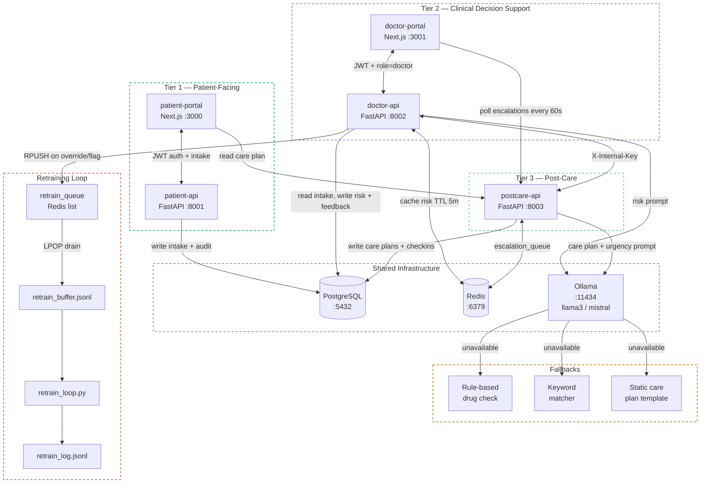

# System Architecture

## Overview

MedAI Platform is a three-tier, local-first medical AI system. Every tier owns a dedicated FastAPI backend and (where needed) a Next.js frontend. All tiers share a single PostgreSQL database, a Redis instance, and an Ollama LLM server.

```
┌─────────────────────────────────────────────────────────────────────┐
│  TIER 1 — Patient-Facing                                            │
│  patient-portal (Next.js :3000)  ←→  patient-api (FastAPI :8001)   │
├─────────────────────────────────────────────────────────────────────┤
│  TIER 2 — Clinical Decision Support                                 │
│  doctor-portal (Next.js :3001)   ←→  doctor-api (FastAPI :8002)    │
├─────────────────────────────────────────────────────────────────────┤
│  TIER 3 — Post-Care                                                 │
│  postcare-api (FastAPI :8003)                                       │
├─────────────────────────────────────────────────────────────────────┤
│  SHARED INFRASTRUCTURE                                              │
│  PostgreSQL :5432  |  Redis :6379  |  Ollama :11434                 │
└─────────────────────────────────────────────────────────────────────┘
```



---

## Directory Layout

```
medical-ai-platform/
├── docker-compose.yml              # Full stack orchestration
├── .env.example                    # Configuration template
├── db/
│   └── init.sql                    # PostgreSQL extension bootstrap (uuid-ossp, pgcrypto)
├── services/
│   ├── patient_api/                # Tier 1 backend  (port 8001)
│   │   ├── main.py                 # Routes: auth, intake, profile, health
│   │   ├── models.py               # ORM: Patient, PatientIntake, AuditLog
│   │   ├── schemas.py              # Pydantic: PatientRegister, IntakeCreate, Token
│   │   ├── auth.py                 # JWT creation + get_current_patient dependency
│   │   ├── encryption.py           # Fernet AES-256 for PHI fields
│   │   ├── database.py             # SQLAlchemy engine + session factory
│   │   ├── settings.py             # Settings loaded from .env
│   │   ├── logging_utils.py        # Structured audit log writer
│   │   └── Dockerfile
│   ├── doctor_api/                 # Tier 2 backend  (port 8002)
│   │   ├── main.py                 # Routes: auth, risk, feedback, retrain trigger, escalations
│   │   ├── models.py               # ORM: Doctor, RiskAssessment, Feedback, Escalation, FollowupCheckin
│   │   ├── schemas.py              # Pydantic: DoctorRegister, FeedbackCreate, RiskAssessmentResponse
│   │   ├── llm.py                  # Ollama + rule-based risk assessment
│   │   ├── auth.py                 # Doctor token + role validation
│   │   ├── encryption.py           # Field decryption (reads encrypted DOB)
│   │   └── Dockerfile
│   └── postcare_api/               # Tier 3 backend  (port 8003)
│       ├── main.py                 # Routes: care plan, check-ins, escalations
│       ├── models.py               # ORM: CarePlan, FollowupCheckin, Escalation
│       ├── schemas.py              # Pydantic: CarePlanCreate, CheckinCreate, EscalationResponse
│       ├── llm.py                  # Care plan generation + urgency assessment
│       ├── auth.py                 # JWT verification + doctor-role guard
│       └── Dockerfile
├── frontend/
│   ├── patient_portal/             # Tier 1 UI  (port 3000)
│   │   └── src/app/
│   │       ├── register/page.tsx
│   │       ├── login/page.tsx
│   │       ├── intake/page.tsx     # 5-step intake wizard
│   │       ├── dashboard/page.tsx
│   │       └── lib/
│   │           ├── api.ts          # API client
│   │           └── auth.ts         # JWT + patient_id in localStorage
│   └── doctor_portal/              # Tier 2 UI  (port 3001)
│       └── src/app/
│           ├── login/page.tsx
│           ├── patients/page.tsx   # Patient list + escalation alerts
│           ├── patients/[id]/page.tsx
│           └── lib/
│               ├── api.ts
│               └── auth.ts
├── scripts/
│   └── retrain_loop.py             # Feedback drain + batch processing
└── data/                           # Runtime output (created on first run)
    ├── retrain_buffer.jsonl
    └── retrain_log.jsonl
```

---

## Service Responsibilities

| Service | Port | Owns |
|---|---|---|
| `patient-api` | 8001 | Patient auth, intake storage, encrypted PHI |
| `doctor-api` | 8002 | Doctor auth, LLM risk assessment, feedback, retrain queue |
| `postcare-api` | 8003 | Care plan generation, follow-up check-ins, escalation creation |
| `patient-portal` | 3000 | Patient registration, intake wizard, care plan dashboard |
| `doctor-portal` | 3001 | Patient list, AI risk panel, feedback form, escalation alerts |
| `postgres` | 5432 | Single shared database (all tables) |
| `redis` | 6379 | Risk assessment cache, retrain queue, escalation queue |
| `ollama` | 11434 | Local LLM inference (llama3 / mistral) |

---

## Request Flows

### Patient Intake

```
patient-portal
  → POST /patients/intake  (patient-api:8001)
      ├── Validate JWT
      ├── Write PatientIntake row
      └── Write AuditLog row
```

### Risk Assessment

```
doctor-portal
  → GET /doctor/patients/{id}/risk  (doctor-api:8002)
      ├── Validate JWT + role=doctor
      ├── Read PatientIntake from PostgreSQL
      ├── Check Redis cache (key: risk:{patient_id}, TTL 5m)
      │   ├── HIT  → return cached assessment
      │   └── MISS → call llm.get_risk_assessment()
      │               ├── Try Ollama (llama3 → mistral, 10s timeout)
      │               └── FALLBACK: rule-based drug interaction check
      ├── Write RiskAssessment row
      ├── Set Redis cache
      └── Return assessment
```

### Follow-up Check-in & Escalation

```
patient-portal (or API client)
  → POST /followup/checkin  (postcare-api:8003)
      ├── Read latest CarePlan (warning_signs)
      ├── Call llm.assess_checkin_urgency()
      │   ├── Ollama urgency classification (routine|monitor|escalate)
      │   └── FALLBACK: keyword matching
      ├── Write FollowupCheckin row
      ├── If urgency == escalate:
      │   ├── Write Escalation row
      │   └── Push to Redis escalation_queue
      └── Return checkin + urgency

doctor-portal
  → polls GET /escalations/pending  every 60s  (postcare-api:8003)
  → POST /escalations/{id}/acknowledge
```

### Feedback → Retraining

```
doctor-portal
  → POST /doctor/patients/{id}/feedback  (doctor-api:8002)
      ├── Write Feedback row
      └── If action == override|flag:
          └── RPUSH retrain_queue  (Redis)

(manual or scheduled)
  → POST /doctor/retrain/trigger  (doctor-api:8002, requires X-Internal-Key)
      └── LPOP all items from retrain_queue
          └── Append to data/retrain_buffer.jsonl

python3 scripts/retrain_loop.py
  ├── Read retrain_buffer.jsonl
  ├── Summarise feedback events
  ├── Write to retrain_log.jsonl
  └── Clear buffer
```

---

## Docker Compose Startup Order

```
postgres  ──(healthy)──┐
redis     ──(healthy)──┤──→  patient-api
                       ├──→  doctor-api
                       └──→  postcare-api

patient-api  ──(started)──→  patient-portal
doctor-api   ──(started)──→  doctor-portal
```

All three APIs wait for postgres and redis to pass health checks before accepting traffic. Table creation runs automatically on first start (SQLAlchemy `create_all`).

---

## Health Checks

Every API exposes `GET /health` returning:

```json
{ "status": "ok" }
```

or, when a dependency is degraded:

```json
{
  "status": "degraded",
  "details": {
    "postgres": "ok",
    "redis": "error: Connection refused"
  }
}
```

---

## Inter-Service Authentication

Service-to-service calls (e.g., `doctor-api` triggering a retrain drain, `postcare-api` generating a care plan) use the `X-Internal-Key` header matched against `INTERNAL_API_KEY` in `.env`. Patient and doctor JWTs are **not** accepted on internal routes.

---

## Environment Variables

| Variable | Used By | Purpose |
|---|---|---|
| `DATABASE_URL` | all APIs | SQLAlchemy connection string |
| `REDIS_URL` | all APIs | Redis connection |
| `OLLAMA_URL` | doctor-api, postcare-api | Ollama inference endpoint |
| `JWT_SECRET` | all APIs | HMAC key for HS256 tokens |
| `FERNET_KEY` | patient-api, doctor-api | AES-256 key for PHI encryption |
| `INTERNAL_API_KEY` | doctor-api, postcare-api | Header secret for service-to-service calls |
| `JWT_ALGORITHM` | all APIs | Default: `HS256` |
| `JWT_EXPIRE_MINUTES` | all APIs | Default: `30` |
| `NEXT_PUBLIC_PATIENT_API_URL` | patient-portal | Browser-visible patient API base URL |
| `NEXT_PUBLIC_DOCTOR_API_URL` | doctor-portal | Browser-visible doctor API base URL |
| `NEXT_PUBLIC_POSTCARE_API_URL` | both portals | Browser-visible postcare API base URL |

---

## Failure Modes

| Failure | Behaviour |
|---|---|
| Ollama timeout / unavailable | Rule-based fallback (10 s timeout); response has `source: "rule_based"`, confidence `"low"` |
| PostgreSQL down | HTTP 503, no stack traces in response body |
| Redis down | Cache miss treated as no-op; queue pushes fail silently with a log warning |
| PHI decryption failure | Field returns `None`; request continues |
| Audit log write failure | DB error rolled back; request continues (logging failure ≠ auth failure) |
| JWT expired | HTTP 401 `Invalid or expired token` |
| Missing `X-Internal-Key` | HTTP 403 `Forbidden` |
